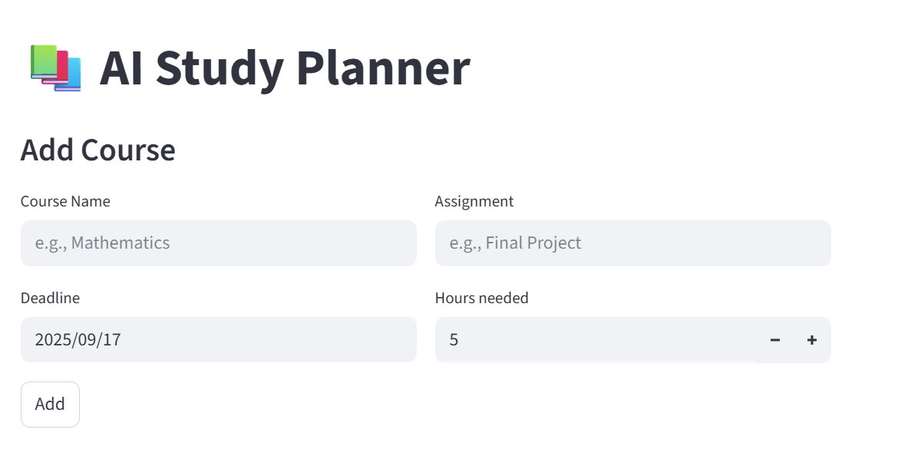
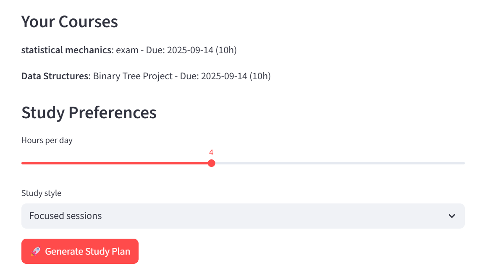
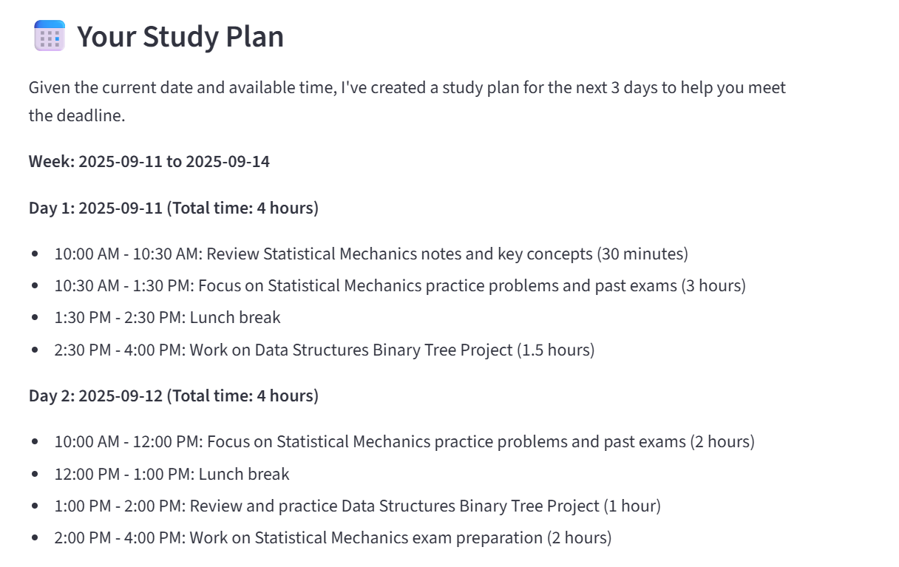
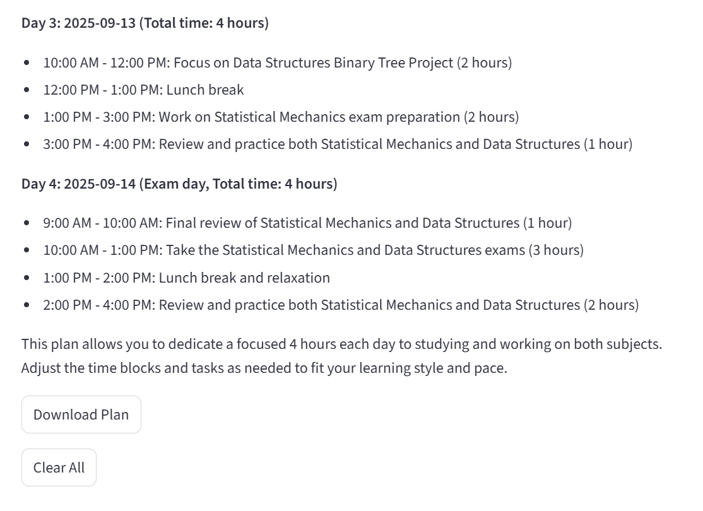

# 📚 AI Study Planner Agent

👨‍🎓 **Student Information**  
- **Name:** Chodabattula Moni Praneeth  
- **University:** Indian Institute of Technology Guwahati  
- **Department:** Engineering Physics (B.Tech)
- **College Email:** p.chodabattula@iitg.ac.in
- **Personal Email:** monipraneeth449@gmail.com  

---

## 🌐 Live Application
🚀 **Try the Live App:** [https://studyplanner-ai-agent.streamlit.app/](https://studyplanner-ai-agent.streamlit.app/)  

---

## 🎯 Project Overview

### The Problem We Solved
University students often spend **2–3 hours every week** manually creating study schedules, which leads to:  
❌ Unbalanced workloads → stress  
❌ Missed deadlines due to poor planning  
❌ Inefficient time allocation across subjects  
❌ Difficulty adapting plans when priorities change  

### Our AI Solution
The **AI Study Planner Agent** automates the entire process by:  
🧠 **Reasoning** — analyzing deadlines, difficulty levels, and available hours  
📋 **Planning** — generating optimized daily/weekly study schedules  
⚡ **Executing** — delivering actionable plans via a clean Streamlit web interface  

**Manual Task Automated**  
- **Before:** Students manually juggle multiple course schedules, deadlines, and study preferences.  
- **After:** The AI Agent generates personalized study plans in **under 30 seconds**.  

---

## 🛠️ Tech Stack
- **Frontend:** Streamlit  
- **Backend / AI Core:** Python + Groq API (LLM reasoning & planning)  
- **Deployment:** Streamlit Cloud  

---

## 📸 Application Screenshots

### Main Interface – Course Input

### Courses & Preferences

### Generated Study Plan Output

---

